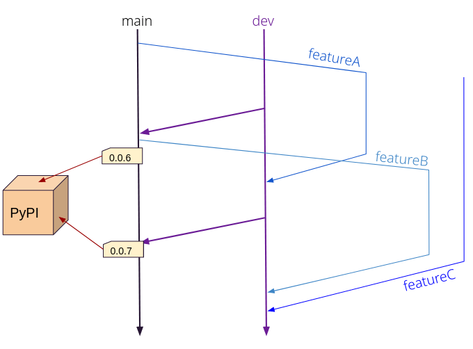

# cassIO

A framework-agnostic Python library to seamlessly integrate Apache Cassandra with ML/LLM/genAI workloads.

**Note**: this is currently an alpha release.

## Users

Installation is as simple as:

```
pip install cassio
```

For example usages and integration with higher-level LLM frameworks
such as LangChain, please visit [cassio.org](https://cassio.org).

## CassIO developers

### Setup

To develop `cassio`, use the `requirements-dev.txt`.

To use the dev version in an integration (e.g. your branch of LangChain),
`pip install -e .` in this `cassio` repo from within the virtual environment
you are using to develop your integration.

### Git flow

_Note: this is a rough guide, use your common sense and consider exceptions._

`main` is where versioned releases occur (the corresponding commits are git-tagged
as `v0.0.7` and similar, parallel to the PyPI releases).

Please do not push/PR more than trivial fixes directly to `main`.

Features should generally be done on specific branches and merged into `dev`
for wider testing. Then, with a slower cadence (such as, when releasing),
`dev` would be merged to `main`.



#### Versioning

We are still at `0.*`. Occasional breaking changes are to be expected,
but please think carefully. A later stronger model of versioning will
be adopted.

### Style

We are trying to land on a strictly enforced style. Currently,
the following directories are kept in check this way:

- `src/cassio/table`
- `src/cassio/vector`
- `src/cassio/utils`
- `tests`
- `src/cassio/keyvalue`
- `src/cassio/history`

This means we try to get clean output from the following
in each of these directories (up to your good will for the time being):

```
black .
ruff .
mypy .
```

### Python version coverage

At the moment we try to run tests under Python3.8 and Python3.10 to try and
catch versions-specific issues
(such as the newer `typing` syntax such as `typeA | typeB`, illegal on 3.8).

### Publishing

- Bump version in setup.py
- Add to `CHANGES.txt`
- Commit the very code that will be built:

```
rm dist/*
python setup.py sdist bdist_wheel
twine upload dist/*
# (login to PyPI ...)
```

### Testing

Please run tests (and add some coverage for new features). This is not
enforced other than to your conscience.

#### Unit testing

You need a virtualenv with the `requirements-dev.txt` installed.

```
pytest tests/unit
```

#### Integration with the DB

You need a virtualenv with the `requirements-dev.txt` installed.

Create the DB connection settings file, `cp TEMPLATE.testing.env .testing.env`
and then edit the properties. You need at least one of either Astra DB or a
Cassandra cluster to use, with vector-search support.

Source with `. .testing.env`.

Launch the tests with

```
pytest tests/integration
```

(you can specify `TEST_DB_MODE` in the env file or override it by prepending
the above command with `TEST_DB_MODE=LOCAL_CASSANDRA` or `ASTRA_DB` for
easy switching).
